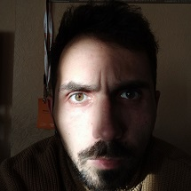

# Kaubenia Vitali Leonidovich

## About me
I am great at working in a team.
I love difficult tasks. In the future I want to become a web developer and work on interesting projects.
## Aducation
-   University: Belarusian State University of Informatics and Radioelectronics (BSUIR)
    major - radio electronics.
-   Rsschool-stage1-q1
## Skills
-   HTML
-   CSS
-   JavaScript
-   Git
## Code example
```
function validatePIN(pin) {
   regexp = /^\d{4}$|^\d{6}$/;
    var result = pin.match(regexp);
  if (!(result == null)) {
      return true;
      }
  else {
    return false;
  }
}
```
## Experience
-   https://bentrend.github.io/rsschool-cv/cv
## English
-   A0-A1
## Contacts
-   Location: Minsk, Belarus
-   E-mail: trend4309@gmail.com
-   Git-hub: https://github.com/Bentrend